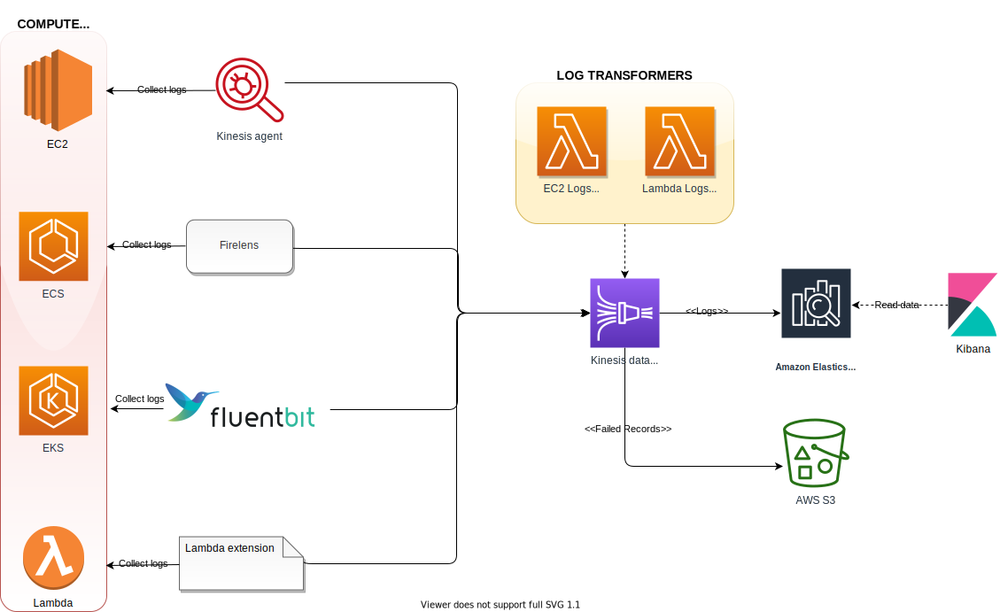
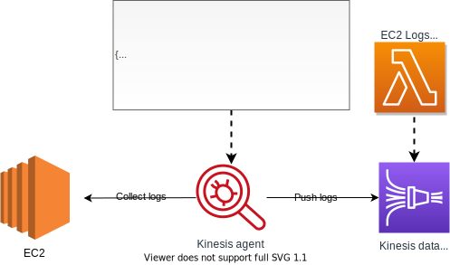
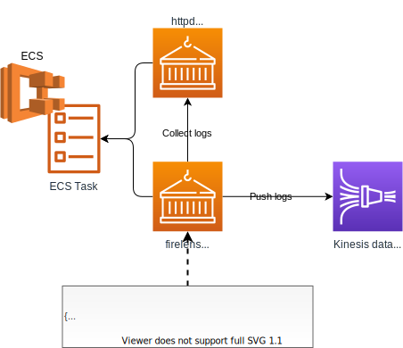
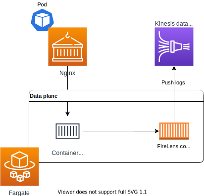
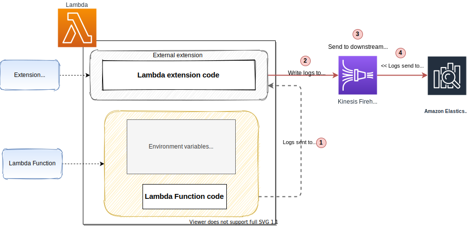
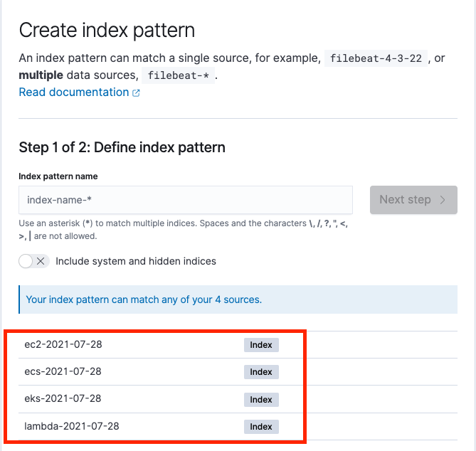
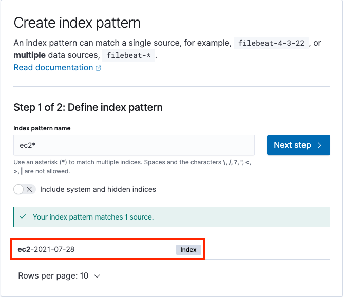
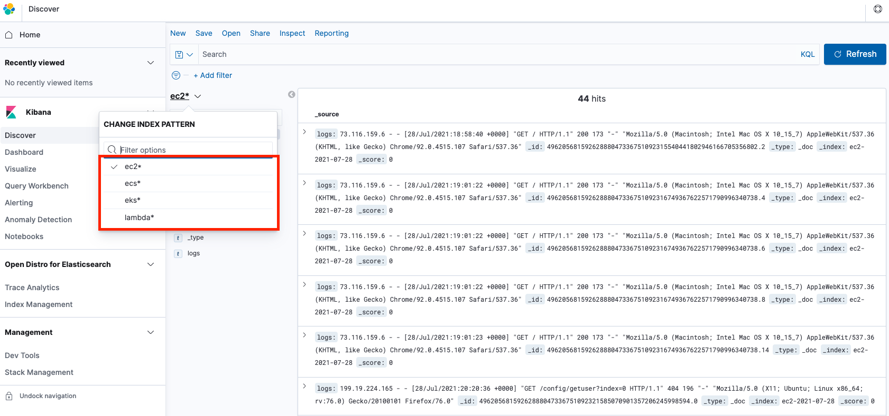

# Unified Log Aggregation and Analytics across compute platforms

## Introduction

The proposed solution shows and approach to unify and centralize logs across different compute platforms like EC2, ECS, EKS and Lambda with Kinesis Data Firehose using log collection agents (EC2 Kinesis agent), log routers (Fluentbit and Firelens) and lambda extension. We can easily deploy the solution presented here on the customer site using the CDK scripts packaged part of this article. Amazon managed Elastic search with Kibana is used to visualize the logs collected across different applications running on different compute platforms.

## Need for unified aggregation system

Having a unified aggregation system provides the following benefits:

* It provides a single point of access to all the logs across different compute platforms.
* Helps to define and standardize the transformations before the log gets delivered to downstream systems like S3, elastic search, redshift, etc
* It provides a secure storage area for log data, before it gets written out to the disk. In the event of machine/application failure, we still have access to the logs emitted from the source machine/application
* The solution proposed in this article using Kibana to visualize the logs to support a single unified system to view and access all the logs.

## Services Overview

Here is a high level overview of different AWS services used in the solution:

* **Amazon EC2**: Amazon Elastic Compute Cloud (Amazon EC2) is a web service that provides secure, resizable compute capacity in the cloud. It is designed to make web-scale cloud computing easier for developers, read more about it [here](https://aws.amazon.com/ec2/).
* **Amazon ECS**: Amazon Elastic Container Service (Amazon ECS) is a web service that makes it easy to run, scale, and manage Docker containers on AWS. It is designed to make the Docker experience easier for developers, read more about it [here](https://aws.amazon.com/ecs/).
* **Amazon EKS**: Amazon Elastic Container Service for Kubernetes (Amazon EKS) is a web service that makes it easy to run, scale, and manage Docker containers on AWS. It is designed to make the Docker experience easier for developers, read more about it [here](https://aws.amazon.com/eks/).
* **Amazon Lambda**: Amazon Lambda is a compute service that lets you run code without provisioning or managing servers. It is designed to make web-scale cloud computing easier for developers, read more about it [here](https://aws.amazon.com/lambda/).
* **Amazon Managed Elastic search**: Amazon Managed Elasticsearch is a managed service that makes it easy to deploy, operate, and scale Elasticsearch in the cloud. It is designed to make the Elasticsearch experience easier for developers, read more about it [here](https://aws.amazon.com/elasticsearch-service/).
* **Amazon Kinesis Data Firehose**: Amazon Kinesis Data Firehose is a fully managed service that makes it easy to stream data to Amazon S3, Amazon Redshift, or Amazon Elasticsearch Service. It is designed to make the data streaming experience easier for developers, read more about it [here](https://aws.amazon.com/kinesis/data-firehose/).

## High level Architecture

Here is the architecture of the solution proposed in this article:



The above architecture uses various log aggregation tools (like log agents, log routers, and lambda extensions) to collect logs from various compute platforms and deliver them to the Kinesis Data Firehose. The Kinesis Data Firehose streams the logs to Elasticsearch. To scale this architecture better each of these compute platforms will stream the logs to a different Kinesis Data Firehose stream which  will get added to a separate elastic search index, rotated every 24 hours.

Let's see in detail how the solution is implemented on each of these compute platforms.

### Amazon EC2

`Amazon Kinesis Agent` is used to collect and stream logs to kinesis data firehose from EC2 instances. Amazon Kinesis agent is a standalone Java software application that offers an easy way to collect and send data to Kinesis Data Firehose. The agent continuously monitors a set of files and sends new data to your Kinesis Data Firehose delivery stream.



CDK script provided part of this article deploys a simple PHP application that generates logs under `/etc/httpd/logs` directory inside the EC2 instance. The Kinesis agent is configured via `/etc/aws-kinesis/agent.json` to watch both `access_logs` and `error_logs`, stream them periodically to Kinesis Data Firehose (`ec2-logs-delivery-stream`).

Since Elastic search expects data in JSON format, we introduce a firehose data transformer (Lambda function) that converts the log data to JSON format before writing it to Elastic search. Here is a sample input and output for the data transformer:

**Input:**

```bash
46.99.153.40 - - [29/Jul/2021:15:32:33 +0000] "GET / HTTP/1.1" 200 173 "-" "Mozilla/5.0 (Windows NT 6.1; WOW64) AppleWebKit/537.36 (KHTML, like Gecko) Chrome/51.0.2704.103 Safari/537.36"
```

```json
{
    "logs" : "46.99.153.40 - - [29/Jul/2021:15:32:33 +0000] \"GET / HTTP/1.1\" 200 173 \"-\" \"Mozilla/5.0 (Windows NT 6.1; WOW64) AppleWebKit/537.36 (KHTML, like Gecko) Chrome/51.0.2704.103 Safari/537.36\"",
}
```

> Notes: Lambda function can be enhanced to extract out timestamp, HTTP, browser information from the log data and store them as seperate attributes in the JSON document.

### Amazon ECS

In case of Amazon ECS we use `FireLens` to send logs directly to Kinesis Data Firehose. FireLens is a container log router for Amazon ECS and AWS Fargate that gives you extensibility to use the breadth of services at AWS or partner solutions for log analytics and storage.



Above architecture hosts firelens as a side car which collect logs from the main container running `httpd` application and send them to Kinesis Data Firehose.

### Amazon EKS

When the recent annoucement of Fluent Bit for Amazon EKS, we no longer need to run a sidecar to route container logs from EKS pods running on AWS Fargate. With the new built-in logging support, you select where you want to send your data and logs are routed to a destination of your choice. Under the hood, EKS on Fargate uses a version of Fluent Bit for AWS, an upstream conformant distribution of Fluent Bit managed by AWS.



CDK script provided part of this article deploys `nginx` container hosted behind an internal application loadbalancer. `nginx` container logs gets pushed to Kinesis Data Firehose (`eks-logs-delivery-stream`) through Fluent Bit plugin.

### Amazon Lambda

For Lambda functions we will use `Amazon Lambda extension` to send logs directly to Kinesis Data Firehose. We `DENY` the logs from being written to the AWS Cloudwatch service.



Once deployed the overall flow looks like below:

* On start-up, the extension subscribes to receive logs for Platform and Function events.
* A local HTTP server is started inside the external extension which receives the logs.
* The extension also takes care of buffering the recieved log events in a synchronized queue and writing it to AWS Kinesis Firehose via direct PUT records.

> Note: Firehose stream name gets specified as an environment variable (AWS_KINESIS_STREAM_NAME).

Since we are interested in only capturing the execution logs of the lambda function, the data transformer will filter out the logs of type `function` before saving it to Elasticsearch.

Here is a sample input and output for the data transformer:

**Input**

```json
[
   {
      "time":"2021-07-29T19:54:08.949Z",
      "type":"platform.start",
      "record":{
         "requestId":"024ae572-72c7-44e0-90f5-3f002a1df3f2",
         "version":"$LATEST"
      }
   },
   {
      "time":"2021-07-29T19:54:09.094Z",
      "type":"platform.logsSubscription",
      "record":{
         "name":"kinesisfirehose-logs-extension-demo",
         "state":"Subscribed",
         "types":[
            "platform",
            "function"
         ]
      }
   },
   {
      "time":"2021-07-29T19:54:09.096Z",
      "type":"function",
      "record":"2021-07-29T19:54:09.094Z\tundefined\tINFO\tLoading function\n"
   },
   {
      "time":"2021-07-29T19:54:09.096Z",
      "type":"platform.extension",
      "record":{
         "name":"kinesisfirehose-logs-extension-demo",
         "state":"Ready",
         "events":[
            "INVOKE",
            "SHUTDOWN"
         ]
      }
   },
   {
      "time":"2021-07-29T19:54:09.097Z",
      "type":"function",
      "record":"2021-07-29T19:54:09.097Z\t024ae572-72c7-44e0-90f5-3f002a1df3f2\tINFO\tvalue1 = value1\n"
   },   
   {
      "time":"2021-07-29T19:54:09.098Z",
      "type":"platform.runtimeDone",
      "record":{
         "requestId":"024ae572-72c7-44e0-90f5-3f002a1df3f2",
         "status":"success"
      }
   }
]
```

**Output**

```json
{
   "logEvent_1":{
      "time":"2021-07-29T19:54:09.096Z",
      "type":"function",
      "record":"2021-07-29T19:54:09.094Z\tundefined\tINFO\tLoading function\n"
   },
   "logEvent_2":{
      "time":"2021-07-29T19:54:09.097Z",
      "type":"function",
      "record":"2021-07-29T19:54:09.097Z\t024ae572-72c7-44e0-90f5-3f002a1df3f2\tINFO\tvalue1 = value1\n"
   },   
}
```

## Build and Deployment

### Assumptions

* AWS CLI - AWS Command-Line Interface (CLI) is a unified tool to manage your AWS services. You can read more about it [here](https://docs.aws.amazon.com/cli/latest/userguide/cli-chap-install.html)
* AWS CDK should be installed in the local laptop, you can read more about it [here](https://docs.aws.amazon.com/cli/latest/userguide/installing.html)
* Git is installed and configured on your machine, you can read more about it [here](https://git-scm.com/downloads)
* AWS Lambda extension for Kinesis Data Firehose is prebuilt and packaged part of this article, you can read more about it [here](https://github.com/aws-samples/aws-lambda-extensions/tree/main/kinesisfirehose-logs-extension-demo)

### Build

* Check out the CDK code by running the following command:

```bash
mkdir unified-logs && cd unified-logs
git clone https://github.com/hariohmprasath/unified-log-aggregation-and-analytics.git .
```

* Build the code by running the following command:

```bash
yarn install && npm run build
```

### Deployment

* If you are running CDK for the first time, run the following command to bootstrap the CDK environment.

```bash
cdk bootstrap \
    --cloudformation-execution-policies arn:aws:iam::aws:policy/AdministratorAccess \
    aws://<AWS Account Id>/<AWS_REGION>
```

> Note: Replace your AWS Account Id and AWS region in the command above. Bootstrap CDK (**ONLY ONCE**, if you have already done this you can skip this part)

* Run the following command to deploy the code:

```bash
cdk deploy --requires-approval
```

**Output**

```bash
 ✅  CdkUnifiedLogStack

Outputs:
CdkUnifiedLogStack.ec2ipaddress = xx.xx.xx.xx
CdkUnifiedLogStack.ecsloadbalancerurl = CdkUn-ecsse-PY4D8DVQLK5H-xxxxx.us-east-1.elb.amazonaws.com
CdkUnifiedLogStack.ecsserviceLoadBalancerDNS570CB744 = CdkUn-ecsse-PY4D8DVQLK5H-xxxx.us-east-1.elb.amazonaws.com
CdkUnifiedLogStack.ecsserviceServiceURL88A7B1EE = http://CdkUn-ecsse-PY4D8DVQLK5H-xxxx.us-east-1.elb.amazonaws.com
CdkUnifiedLogStack.eksclusterClusterNameCE21A0DB = ekscluster92983EFB-d29892f99efc4419bc08534a3d253160
CdkUnifiedLogStack.eksclusterConfigCommand515C0544 = aws eks update-kubeconfig --name ekscluster92983EFB-d29892f99efc4419bc08534a3d253160 --region us-east-1 --role-arn arn:aws:iam::xxx:role/CdkUnifiedLogStack-clustermasterroleCD184EDB-12U2TZHS28DW4
CdkUnifiedLogStack.eksclusterGetTokenCommand3C33A2A5 = aws eks get-token --cluster-name ekscluster92983EFB-d29892f99efc4419bc08534a3d253160 --region us-east-1 --role-arn arn:aws:iam::xxx:role/CdkUnifiedLogStack-clustermasterroleCD184EDB-12U2TZHS28DW4
CdkUnifiedLogStack.elasticdomainarn = arn:aws:es:us-east-1:xxx:domain/cdkunif-elasti-rkiuv6bc52rp
CdkUnifiedLogStack.s3bucketname = cdkunifiedlogstack-logsfailederrcapturebucket0bcc-xxxxx
CdkUnifiedLogStack.samplelambdafunction = CdkUnifiedLogStack-LambdatransformerfunctionFA3659-c8u392491FrW

Stack ARN:
arn:aws:cloudformation:us-east-1:xxxx:stack/CdkUnifiedLogStack/6d53ef40-efd2-11eb-9a9d-1230a5204572
```

> Note: CDK will take care of building the required infrastructure, deploying the sample application and collecting logs from different sources to Elastic search.

Here are few key info about the built stack:

| Parameter  | Description |
| ------------- | ------------- |
| ec2ipaddress  | Public IP address of the EC2 instance, deployed with sample PHP application |
| ecsloadbalancerurl | URL of the ECS Load Balancer, deployed with `httpd` application |
| eksclusterClusterNameCE21A0DB | EKS cluster name, deployed with `nginx` application |
| samplelambdafunction | Sample Lambda function using `lambda extension` to send logs to kinesis data firehose |
| elasticdomainarn | ARN of the Elasticsearch domain |

## Visualizing logs

### Generating logs

To visualize the logs, we need to generate some sample logs. Here is how we can generate them for each of the services:

* **AWS Lambda** - Run the following command couple of times to generate logs:

You can invoke the Lambda function using the following CLI command

```bash
aws lambda invoke \
    --function-name "<<samplelambdafunction>>" \
    --payload '{"payload": "hello"}' /tmp/invoke-result \
    --cli-binary-format raw-in-base64-out \
    --log-type Tail
```

>Note: Make sure to replace `samplelambdafunction` with the actual lambda function name

The function should return ```"StatusCode": 200```, with the below output

```bash
{
    "StatusCode": 200,
    "LogResult": "<<Encoded>>",
    "ExecutedVersion": "$LATEST"
}
```

* **AWS EC2** - Run the following command couple of times to generate logs:

```bash
curl http://ec2ipaddress:80
```

>Note: Make sure to replace `ec2ipaddress` with the public IP address of the EC2 instance

* **AWS ECS**  - Run the following command couple of times to generate logs:

```bash
curl http://ecsloadbalancerurl:80
```

>Note: Make sure to replace `ecsloadbalancerurl` with the public ARN of the AWS Application Load Balancer

* **AWS EKS** - We have deployed the `nginx` application with internal load balancer, so the load balancer will hit the health check point of the application, which is sufficient to generate the access logs.

### Visualization

* Login in to AWS console and navigate to the [Elasticsearch service](https://console.aws.amazon.com/es/home).
* Click on the hyperlink provided for `Kibana` URL. Visit this [page](https://docs.aws.amazon.com/elasticsearch-service/latest/developerguide/es-kibana.html) to configure the access to the Kibana console.
* To create separate index patterns for every compute log, click on `Discover` menu under `Kibana` section in the side bar and start creating a new index pattern for each of these compute logs.

> Note: We can see separate indexes for each compute logs partitioned by date, like below:



Here is how we can create index patterns for ec2 logs:



* Once we create all the index pattern, we can start analyzing the logs using `Discover` menu under `Kibana` section in the side bar. This provides a single searchable and unified interface for all the logs that different applications have generated deployed in various compute log platforms. We can switch between different logs using `Change index pattern` submenu.



## Cleanup

Run the following command from the root directory to delete the stack:

```bash
cdk destroy
```

> Note: The stack will be deleted after the command is executed.

## Conclusion

We have shown how we unify and centralize logs across different compute platforms using Kinesis data firehose and ElasticSearch. This approach allows customers to analyze logs quicker and understand the root cause of failures, all using a single platform rather than using different platforms for different services.

## Resources

* [CDK with EKS on Fargate](https://github.com/aws-samples/cdk-eks-fargate)
* [Ingest streaming data into Amazon Elasticsearch Service within the privacy of your VPC with Amazon Kinesis Data Firehose](https://aws.amazon.com/blogs/big-data/ingest-streaming-data-into-amazon-elasticsearch-service-within-the-privacy-of-your-vpc-with-amazon-kinesis-data-firehose/)
* [Using AWS Lambda extensions to send logs to custom destinations](https://aws.amazon.com/blogs/compute/using-aws-lambda-extensions-to-send-logs-to-custom-destinations/)
* [Custom log routing with ECS using firelens](https://docs.aws.amazon.com/AmazonECS/latest/developerguide/using_firelens.html)
